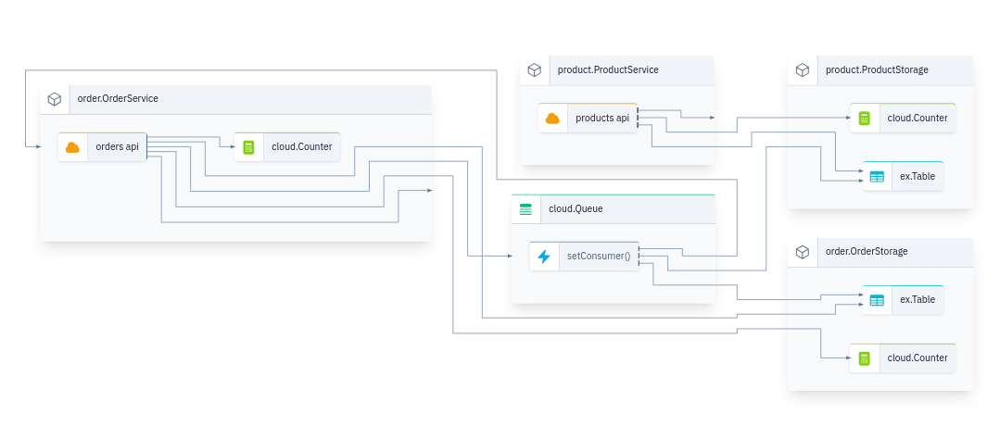

## What is Winglang

A programming language for the cloud. Wing combines infrastructure and runtime code in one language, enabling developers to stay in their creative flow, and to deliver better software, faster and more securely. [learn more](https://www.winglang.io/)

## Workshop Objectives

In this woorkshop, you'll learn

- How to build a rest api using winglang.

- How to use queues in winglang.

- How to query winglang database table.

## Prerequisite

Inorder to successfully run a wing application, the following is required:

- [Node.js v20 or later]()

- [IDE (vs code recommended)]()

- [wing cli]()

## Intended Audience

This workshop is meant for beginners and software engineers that which to build applications on the cloud.

