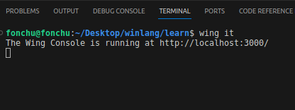

## Initializing a  new Winglang application

To create a new winglang application from scratch, follow the steps bellow:

- Create a new folder with name `product-ordering-api`

- Within this folder, create a new file with name `main.w`

The `main.w` file is the entry point to the wing application and it contains the code and cloud definitions to the workshop.

Add the following code snippet in the `main.w` file.

```
log("Hello world!. Welcome to wing cloud")
```

Save this file and open the project directory in your terminal. Once opened in the terminal, run the command below to execute the cloud.

`wing it`




