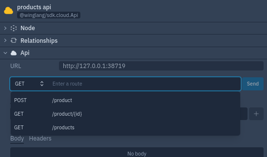

## Define the ProductStorage Class that Implements the IProductStorage Interface.

In `products.w` file, add the following code.


```
pub class ProductStorage impl IProductStorage {
    db: ex.Table;
    counter: cloud.Counter;
    
    new() {
      let tableProps = ex.TableProps{
        name: "ProductsTable",
        primaryKey: "id",
        columns: {
          id: ColumnType.STRING,
          name: ColumnType.STRING,
          qty: ColumnType.NUMBER,
          price: ColumnType.NUMBER,
          imageUrl: ColumnType.STRING
        }
      };
      this.db = new ex.Table(tableProps);
      this.counter = new cloud.Counter();
    }
  }
  ```

  Let's break down the code.
  - We create a public class with name `ProductStorage` that implements the `IProductStorage` interface.

  - We initialize the database table and the counter object.

  - We define the table properties (table props) where we specify:
    - Table name
    - The primary key
    -  The Table Columns

- Finally we instantiate the table object from the `ex` library while passing the `tableProps`

## Implementing the methods define in the IProductStorage Interface.

Within the define class above, add the following methods

#### 1. Add method

```
  
    inflight _add(id: str, j: Json) {
      this.db.insert(id, j);
    }

    pub inflight add(product: Json): str {
      let id = "{this.counter.inc()}";
      let productJson = {
        id: id,
        name: product.get("name"),
        qty: product.get("qty"),
        price: product.get("price"),
        imageUrl: product.get("imageUrl")
      };
      this._add(id, productJson);
      log("adding task {id} with data: {productJson}");
      return id;
    }
  
```

The above code snippet implements the `add()` defined in the interface. 

- It takes and argument of type `Json`.
- Inserts the item in the table.
- It returns `string` that tells whether the item was successfully inserted or not.


#### 2.  Get method

The `get method` takes the `id` and returns an object of the product that corresponds to that id.

```
    pub inflight get(id: str): Product {
    let productJson = this.db.tryGet(id);
        return Product.fromJson(productJson);
    }
```

#### 3. remove method

The `remove method` takes the `id` and delete the corresponding product from the database table.

```
    pub inflight remove(id: str) {
      this.db.delete(id);
      log("deleting product {id}");
    }
```

#### 4. list method

The `list method` returns the list of all the products found in the database table.

```
    pub inflight list(): Array<Json> {
    let productJson = this.db.list();
        return productJson;
    }
```

#### 5. Update method

The update method takes the product's `id` and `quantity` and updates the corresponding product item in the database table.

```
    pub inflight updateProduct(id: str, qty: num) {
        let productId = id;
        let orderQty = qty;
        let response = this.db.tryGet(productId);
        let prodQty = response!.get("qty");
        let totalQty = num.fromJson(prodQty) - orderQty;
        let updatedItem = {
          qty: totalQty
        };
        this.db.update(productId, updatedItem);
      }
```


> Download the complete code.

## Product Endpoints


