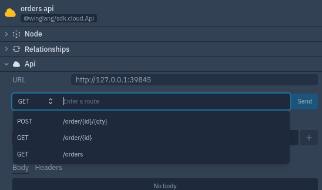

## Define the OrderStorage Class that Implements the IOrderStorage Interface.

In `orders.w` file, add the following code.


```
pub class OrderStorage impl IOrderStorage {
  db: ex.Table;
  counter: cloud.Counter;
  new() {
    let orderProps = ex.TableProps{
      name: "OrdersTable",
      primaryKey: "id",
      columns: {
        id: ColumnType.STRING,
        prodId: ColumnType.STRING,
        qty: ColumnType.NUMBER,
        status: ColumnType.STRING
      }
    };
    this.db = new ex.Table(orderProps);
    this.counter = new cloud.Counter();
  }
}
  ```

  Let's break down the code.
  - We create a public class with name `OrderStorage` that implements the `IOrderStorage` interface.

  - We initialize the database table and the counter object.

  - We define the table properties (table props) where we specify:
    - Table name
    - The primary key
    -  The Table Columns

- Finally we instantiate the table object from the `ex` library while passing the `tableProps`

## Implementing the methods define in the IOrderStorage Interface.

Within the define class above, add the following methods

#### 1. Add method

```
  
pub inflight add(name: str, orderData: Json) {
    let id = "{this.counter.inc()}";
    this.db.insert(id, orderData);
    
}
  
```

The above code snippet implements the `add()` defined in the interface. 

- It takes and argument of type `Json`.
- Inserts the item in the table.
- It returns `string` that tells whether the item was successfully inserted or not.


#### 2.  Get method

The `get method` takes the `id` and returns an object of the `order` that corresponds to that id.

```
  pub inflight get(id: str): Order {
  let orderJson = this.db.tryGet(id);
      return Order.fromJson(orderJson);
  }

```

#### 3. remove method

The `remove method` takes the `id` and delete the corresponding `order` from the database table.

```
  pub inflight remove(id: str) {
    this.db.delete(id);
    log("deleting order {id}");
  }
```

#### 4. list method

The `list method` returns the list of all the orders found in the database table.

```
  pub inflight list(): Array<Json> {
  let orderJson = this.db.list();
      return orderJson;
  }
```

#### 5. Update method

The update method takes the order's `id` and `status` and updates the corresponding order item in the database table.

```
  pub inflight updateOrderStatus(id: str, status: str) {
      let updatedItem = {
        status: status
      };
      this.db.update(id, updatedItem);
    }
```


> Download the complete code.

## Order Endpoints


